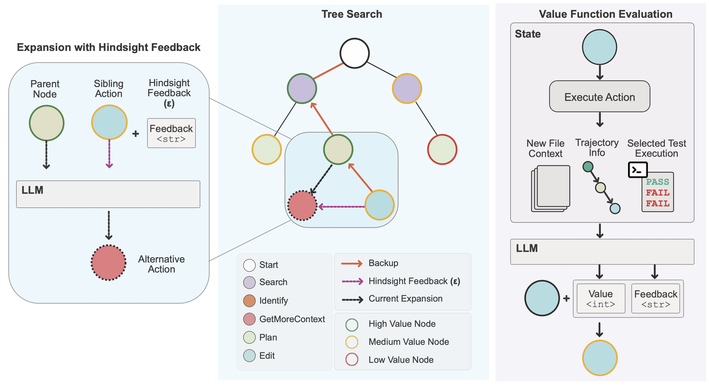

# SWE-search


[📜 Paper](https://arxiv.org/abs/2311.00136) | [📄 Project Page](https://a-antoniades.github.io/Neuroformer_web/)


<a href="assets/method.pdf" target="_blank">
  
</a>


## Description of the Flow
The search algorithm operates in a loop, following these main steps to explore and evaluate possible actions:

 * **Selection:** Choose the next `Node` to expand using a `Selector` strategy. The selector evaluates the available nodes (usually expandable descendants) and selects the most promising one based on predefined criteria like visit count, value estimates, or heuristics.
 * **Action Generation:**
   * **Feedback Generation:** Before generating an action for the selected `Node`, use a `FeedbackGenerator` to provide insights or guidance based on the current node's state.
   * **Action Generation**: Use an `Agent` to generate a new action for the `Node`, utilizing the generated feedback and other contextual information. This action represents a possible step or decision in solving the problem.
 * **Simulation**:
   * **Action Execution:** Execute the `Action` within the given context (e.g., workspace or file context). This simulates the outcome of taking that action in the environment.
   * **Reward Evaluation:** Use a `ValueFunction` to evaluate the outcome of the action execution, assigning a reward to the `Node`. The reward reflects how favorable or successful the action's outcome is towards achieving the goal.
 * **Backpropagation:** Propagate the obtained reward back up the tree, updating the value estimates and visit counts of ancestor nodes. This process helps inform future selections by reinforcing paths that lead to better outcomes.

When the search process finishes (based on predefined stopping criteria), the algorithm needs to determine the best solution found. This involves selecting the most promising `Node` (or trajectory) using a `Discriminator`, which assesses the nodes based on their rewards and possibly other factors.

## Key Components

### Node
   
```python
class Node(BaseModel):
    node_id: int = Field(..., description="The unique identifier of the node")
    parent: Optional['Node'] = Field(None, description="The parent node")
    children: List['Node'] = Field(default_factory=list, description="The child nodes")
    is_duplicate: bool = Field(False, description="Flag to indicate if the node is a duplicate")
    action: Optional[Action] = Field(None, description="The action associated with the node")
    output: Optional[ActionOutput] = Field(None, description="The output of the executed action")
    reward: Optional[Reward] = Field(None, description="The reward of the node")
    visits: int = Field(0, description="The number of times the node has been visited")
    value: float = Field(0.0, description="The total value (reward) of the node")
    file_context: Optional[FileContext] = Field(None, description="The file context state associated with the node")
    message: Optional[str] = Field(None, description="The message associated with the node")
    feedback: Optional[str] = Field(None, description="Feedback provided to the node")
    completions: Dict[str, Completion] = Field(default_factory=dict, description="The completions used in this node")
``` 

### Selector

```python
class Selector(ABC):
    @abstractmethod
    def select(self, nodes: List[Node]) -> Optional[Node]:
        """
        Selects the next node to expand from a list of candidate nodes.

        Args:
            nodes (List[Node]): A list of candidate nodes to select from.

        Returns:
            Optional[Node]: The selected node, or None if no suitable node is found.
        """
        pass
```

### ActionAgent

```python
class ActionAgent:
   
    def generate_action(self, node: Node) -> Action:
        """
        Generates an action for the given node, potentially using feedback.

        Args:
            node (Node): The node for which to generate an action.

        Returns:
            Action: The generated action.
        """
        pass
``` 

### Action

```python
class Action:
   
   file_context: FileContext | None = None
   workspace: Workspace | None = None

    def execute(self) -> ActionOutput:
        """
        Execute the action.
        """
        pass
```

### ValueFunction

```python
class ValueFunction(ABC):
    @abstractmethod
    def get_reward(self, node: Node) -> Reward:
        """
        Evaluates the node's outcome and assigns a reward.

        Args:
            node (Node): The node to evaluate.

        Returns:
            Reward: The calculated reward
        """
        pass
``` 

#### Reward

```python
class Reward(OpenAISchema):
    explanation: Optional[str] = Field(None, description="An explanation and the reasoning behind your decision.")
    feedback: Optional[str] = Field(None, description="Feedback to the alternative branch.")
    value: int = Field(..., description="As ingle integer value between -100 and 100 based on your confidence in the correctness of the action and its likelihood of resolving the issue")
``` 

### FeedbackGenerator

```python

class FeedbackGenerator(ABC):
    @abstractmethod
    def generate_feedback(self, node: Node) -> str:
        """
        Generates feedback for a given node to inform the next action.

        Args:
            node (Node): The node for which to generate feedback.

        Returns:
            str: The feedback message to be used in action building.
        """
        pass
``` 

### Discriminator

```python
class Discriminator(ABC):
    @abstractmethod
    def select(self, nodes: List['Node']) -> Optional['Node']:
        """
        Selects the best node from a list of nodes based on specific criteria.

        Args:
            nodes (List[Node]): A list of nodes to evaluate.

        Returns:
            Optional[Node]: The node deemed the best, or None if no suitable node is found.
        """
        pass
``` 
